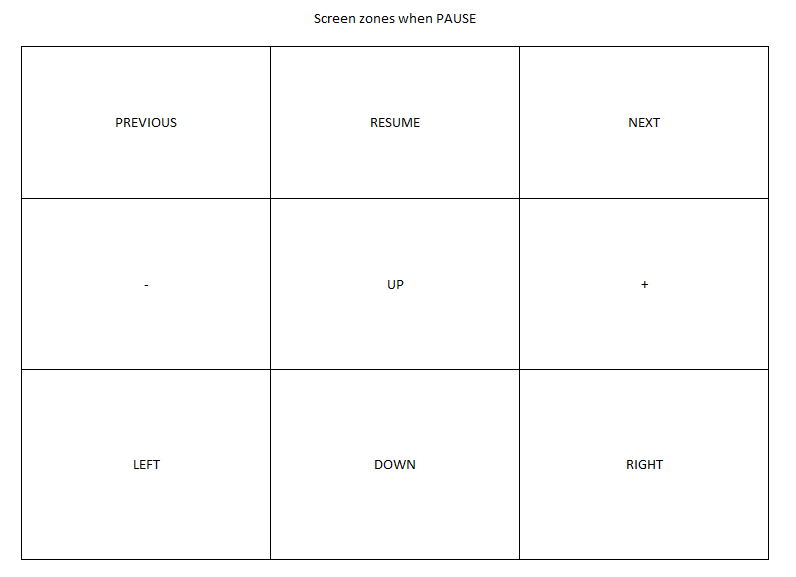

# Digital photo frame
Digital photo frame from photos received on Gmail or in Firebase

# Prerequisite
## Python requirements
> pip install -r requirements.txt

## Console cloud Google
1) Create project on https://console.cloud.google.com/
2) Activate Gmail API
3) Create credentials "OAuth client ID"
4) Download JSON and save as _credentials.json_ in root project

## Gmail
On gmail, create a new label where your photos will be stored.
Yan can also create a filter that will sort all the photos under this label

### Run
> python labels_gmail.py

Outputs all labels : ID - Label

Copy the ID of your new Label and paste in the _.env_ file **_GMAIL_LABEL_ID_**

**_NOTE_:** _First time you launch the app, you will be redirected to google in order to login.   A "token.json" file will be created. This file contains information to stay logged in._

## Firebase
**Optional if Gmail is configured**

- Create Firebase project
- Firebase Admin SDK service account
- Service account credential file : Set **_GOOGLE_APPLICATION_CREDENTIALS_** key in _.env_ file with the path

Follow this setup : https://firebase.google.com/docs/admin/setup/

## Weather.com
This digital photo frame displays temperature and time in specified city.

On [weather.com](https://weather.com), You need to retrieve the city ID by searching for its name in the search bar and copying the ID contained in the URL.

Then, add your own city in [weather_com.py](./src/weather_com.py).

## Environment file
In the _.env_ file, these values are required

- ##### GMAIL_LABEL_ID : Label ID where your photos are stored
- ##### PROJECT_PATH : Absolute path of the project
- ##### GOOGLE_APPLICATION_CREDENTIALS (if you use firebase) : Path to service account credentials _service-account-file.json_
- ##### FIREBASE_STORAGE_BUCKET (if you use firebase) : storage bucket's name found on https://console.firebase.google.com page where you see all files uploaded

## Screen zones
When slideshow is running, screen is divided into 3 columns :

||||
|-|-|-|
|PREVIOUS | PAUSE | NEXT|

When paused, the screen is divided into 9 pieces to allows 9 user actions :

||||
|---|---|---|
|PREVIOUS  | RESUME    | NEXT|
|ZOOM -    | MOVE UP   | ZOOM +|
|MOVE LEFT | MOVE DOWN | MOVE RIGHT|

